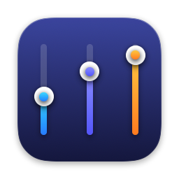
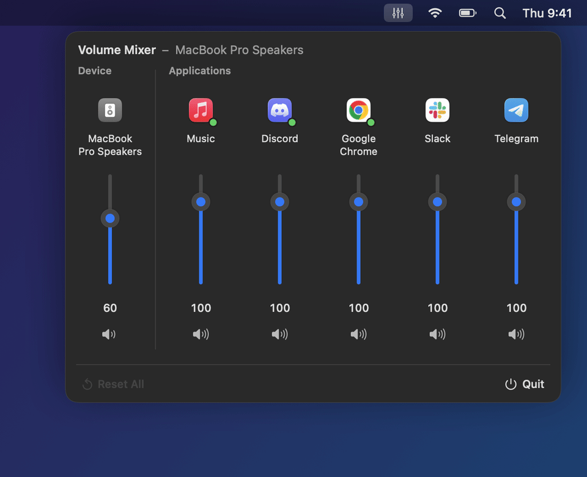
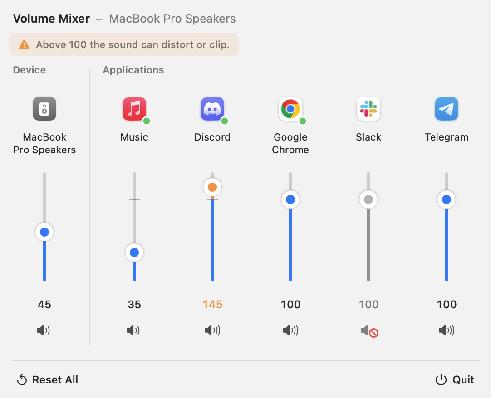

<p align="center"></p>

# AppVolume

[](https://github.com/elad12390/AppVolume/actions/workflows/ci.yml)
[](https://github.com/elad12390/AppVolume/releases/latest)
[](LICENSE)

**A Windows-style volume mixer for macOS.** Set the volume of every app separately, right from the menu bar. No audio drivers, no virtual devices.

<p align="center">
  
</p>

## Features

- **Per-app volume, 0–200%.** One vertical channel per app that is using audio, laid out like the Windows Volume Mixer.
- **Master channel.** The **Device** channel controls your output device's system volume and stays in sync with the volume keys.
- **Mute any app** with the speaker button under its slider.
- **Boost quiet apps past 100%.** The slider has a notch at 100 and snaps to it; the boost range turns orange, a soft limiter rounds off peaks, and a notice reminds you that boosting can distort.
- **Mouse wheel or trackpad** over a slider nudges the level.
- **Remembers your settings** per app and re-applies them when the app relaunches.
- **Follows your output device.** Switch to headphones or AirPods and adjusted apps move with you.
- **Zero overhead for untouched apps.** An app at 100% plays exactly as it normally would.

<p align="center">
  <picture>
    <source media="(prefers-color-scheme: dark)" srcset="docs/screenshot-dark.png">
    
  </picture>
</p>

## How it works

AppVolume uses **Core Audio process taps**, a public API added in macOS 14.2. When you move an app's slider away from 100%:

1. A private tap is created for that app's audio processes, with *mute when tapped*, so its normal output goes quiet.
2. A private aggregate device combines the tap with your current output device.
3. A real-time IO callback plays the tapped audio to the output device with your gain applied (smoothly ramped, and soft-limited above 100%).

Bring the slider back to 100% and the tap and aggregate device are destroyed, so the app is untouched again. Helper processes (like Chrome's or Electron apps' audio helpers) are grouped under their parent app.

Nothing is installed system-wide: there is no kernel extension, HAL plug-in or virtual sound card.

## Install

1. Download the latest **AppVolume-x.y.z.dmg** from [Releases](https://github.com/elad12390/AppVolume/releases/latest). It runs on macOS 15 Sequoia or later, on Apple Silicon and Intel.
2. Open the DMG and drag **AppVolume** into **Applications**.
3. Open AppVolume. The first time, macOS blocks it: the app is signed but not notarized, since that needs a paid Apple Developer account. Go to **System Settings › Privacy & Security**, scroll down and click **Open Anyway**. Or run this once:

   ```sh
   xattr -dr com.apple.quarantine /Applications/AppVolume.app
   ```

4. Click the mixer icon in the menu bar.

## Build from source

Needs macOS 15+ and Xcode or the Command Line Tools (`xcode-select --install`).

```sh
git clone https://github.com/elad12390/AppVolume.git
cd AppVolume
scripts/build-app.sh --open      # builds build/AppVolume.app and launches it
scripts/make-dmg.sh              # packages build/AppVolume-<version>.dmg
```

`UNIVERSAL=1` builds for Apple Silicon and Intel (needs full Xcode). With a Developer ID certificate, `make-dmg.sh` can also sign and notarize:

```sh
SIGN_IDENTITY="Developer ID Application: Your Name (TEAMID)" \
NOTARY_PROFILE=notary scripts/make-dmg.sh   # profile from: xcrun notarytool store-credentials notary
```

### Releases

CI builds every push and pull request. Pushing a tag like `v1.2.0` builds a universal DMG on GitHub Actions and publishes it as a release.

## Permission

The first time you change an app's volume, macOS asks to let AppVolume record system audio. This is what lets it tap an app's output; nothing is recorded or saved. If you declined, or an app goes silent when you move its slider, enable AppVolume under **System Settings › Privacy & Security › Screen & System Audio Recording › System Audio Recording Only**.

If you build it yourself, every rebuild gets a new ad-hoc signature, so macOS may ask again.

## Tips

- Drag back to the notch (or scroll past it) to land exactly on **100**, which removes the app's tap.
- Hover a channel to reveal its reset button. **Reset All** puts every app back to 100%.
- More than six apps? Scroll the row sideways or drag the bar under it.

## Limitations

- Safari plays audio through a WebKit helper process, so it appears under that helper's name rather than "Safari".
- Apps you adjust get a few milliseconds of extra latency from the tap. Apps at 100% are unaffected.
- Output devices without software volume (some HDMI and USB DACs) show a disabled Device slider.

## Development

```
Sources/AppVolume/
  AppVolumeApp.swift      menu bar entry point
  ContentView.swift       mixer UI (channels, vertical slider, scrollbar)
  VolumeController.swift  per-app settings, tap lifecycle, output device
  AudioAppMonitor.swift   lists audio processes and groups them by app
  AppTap.swift            process tap + aggregate device + real-time gain
  CoreAudioUtils.swift    Core Audio property helpers and listeners
scripts/
  build-app.sh            build and bundle the .app
  make-dmg.sh             package a signed DMG
.github/workflows/        CI build, tag-triggered release
  make-demo.sh            render docs/demo.gif and screenshots (needs ffmpeg)
  make-icon.sh            render Resources/AppIcon.icns from code (scripts/icon/main.swift)
```

The demo and screenshots are rendered from the real SwiftUI views with sample data (`scripts/make-demo.sh`), so they stay in sync with the UI.

## License

[MIT](LICENSE)
